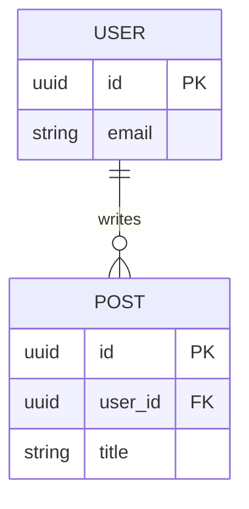
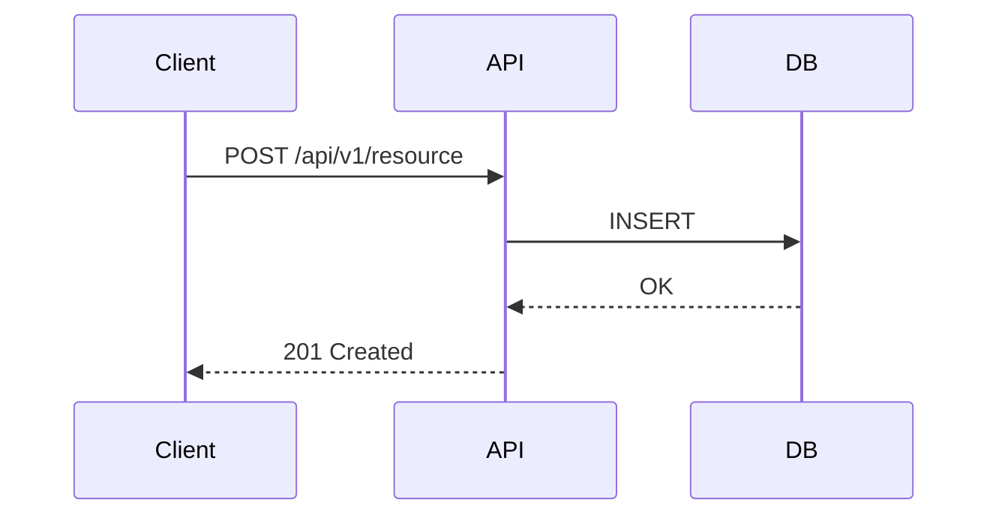

# 設計仕様書

> **ファイル**: `specs/design/DS-001_<feature-name>.md`
> **対応PRD**: PRD-001
> **ステータス**: Draft | Review | Approved
> **作成日**: YYYY-MM-DD

---

## 1. 概要

<!-- PRDの要件をどう実現するかの技術的方針 -->

## 2. システム構成

```
[コンポーネント図 or テキスト図をここに]

Client → API Gateway → Service A → DB
                     → Service B → Cache
```

## 3. データモデル

### エンティティ: `<EntityName>`

| フィールド | 型 | 必須 | 説明 |
|-----------|-----|------|------|
| id | uuid | ✓ | 主キー |
| created_at | datetime | ✓ | 作成日時 |
| | | | |

### ER図（Mermaid）



## 4. APIインターフェース

> 詳細は `specs/api/` を参照

| メソッド | パス | 説明 |
|--------|------|------|
| GET | /api/v1/resource | 一覧取得 |
| POST | /api/v1/resource | 新規作成 |

## 5. シーケンス図



## 6. エラーハンドリング方針

| エラーケース | HTTPステータス | ユーザーへの表示 |
|------------|--------------|----------------|
| バリデーションエラー | 400 | 入力値を確認してください |
| 認証エラー | 401 | ログインが必要です |
| 権限エラー | 403 | 権限がありません |
| Not Found | 404 | データが見つかりません |
| サーバーエラー | 500 | しばらく後に再試行してください |

## 7. 技術的考慮事項

### セキュリティ
- 

### パフォーマンス
- 

### スケーラビリティ
- 

## 8. テスト方針

- ユニットテスト: カバレッジ80%以上
- 統合テスト: 主要フローをカバー
- E2Eテスト: クリティカルパスのみ

## 9. 変更履歴

| 日付 | 変更者 | 変更内容 |
|------|--------|---------|
| YYYY-MM-DD | | 初版作成 |
