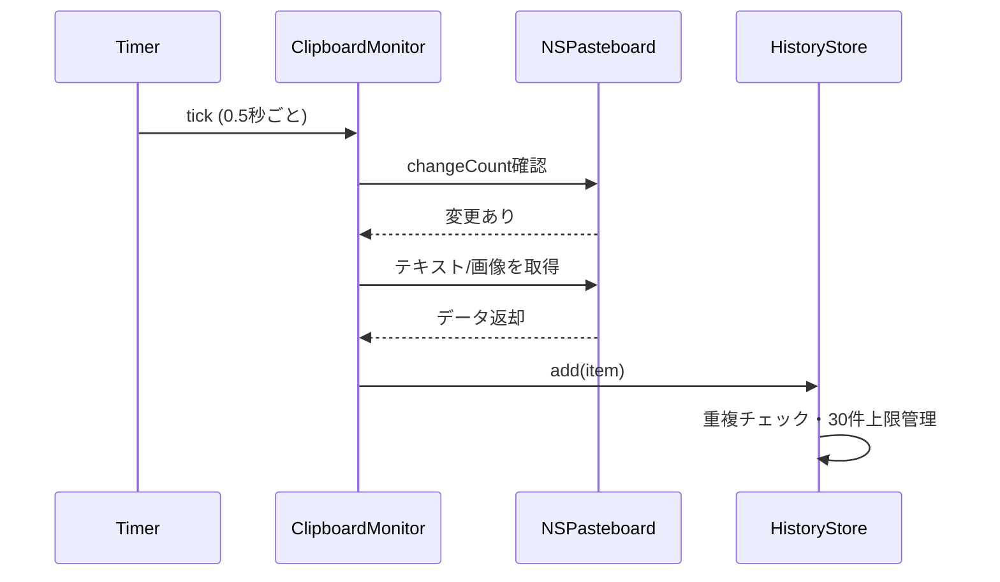
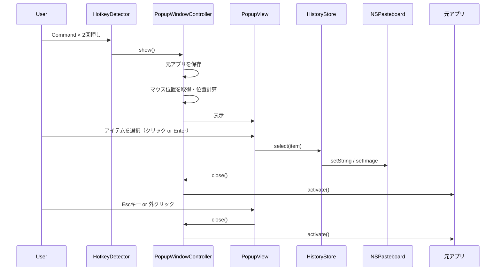

# 設計仕様書

> **ファイル**: `specs/design/DS-001_clipboard-history.md`
> **対応PRD**: PRD-001
> **ステータス**: Draft
> **作成日**: 2026-04-10

---

## 1. 概要

macOSのメニューバー常駐アプリとして実装する。
NSPasteboardをポーリング監視してクリップボード変更を検知し、インメモリの配列で最大30件を管理する。
CGEventTapでCommandキーの連続2回押しを検知し、マウス位置付近にSwiftUIのフローティングウィンドウを表示する。

---

## 2. システム構成

```
┌─────────────────────────────────────────────────────┐
│  ClipBoardApp (macOS Menu Bar App)                  │
│                                                     │
│  ┌─────────────────┐    ┌──────────────────────┐   │
│  │ AppDelegate      │    │ ClipboardMonitor      │   │
│  │ - NSStatusItem   │    │ - NSPasteboard監視    │   │
│  │ - メニュー管理   │    │ - 0.5秒ポーリング     │   │
│  └────────┬────────┘    └──────────┬───────────┘   │
│           │                        │                │
│           ▼                        ▼                │
│  ┌─────────────────────────────────────────────┐   │
│  │ HistoryStore (ObservableObject)              │   │
│  │ - [ClipboardItem] 最大30件                   │   │
│  │ - 追加 / クリア                              │   │
│  └─────────────────────────────────────────────┘   │
│           ▲                        ▲                │
│           │                        │                │
│  ┌────────┴────────┐    ┌──────────┴───────────┐   │
│  │ HotkeyDetector   │    │ PopupWindowController │   │
│  │ - CGEventTap     │    │ - NSPanel管理         │   │
│  │ - Command×2検知  │    │ - マウス位置計算      │   │
│  └─────────────────┘    └──────────────────────┘   │
│                                   │                 │
│                          ┌────────┴───────┐        │
│                          │ PopupView       │        │
│                          │ (SwiftUI)       │        │
│                          └────────────────┘        │
└─────────────────────────────────────────────────────┘
```

---

## 3. データモデル

### エンティティ: `ClipboardItem`

| フィールド | 型 | 必須 | 説明 |
|-----------|-----|------|------|
| id | UUID | ✓ | 一意識別子 |
| type | ClipboardItemType | ✓ | テキスト or 画像 |
| text | String? | - | テキスト内容（type == .text のとき）|
| imageData | Data? | - | 元画像データ（type == .image のとき、ペースト時に使用）|
| thumbnail | NSImage? | - | 表示用極小サムネイル（type == .image のとき、UI表示専用）|
| copiedAt | Date | ✓ | コピーされた日時 |

> **メモリ方針**: 画像はNSImageをそのまま保持しない。元データをDataで保持し、表示用サムネイルのみNSImageとして生成・キャッシュする。

### 列挙型: `ClipboardItemType`

```swift
enum ClipboardItemType {
    case text
    case image
}
```

### HistoryStore の状態

```
items: [ClipboardItem]   // 新しい順、最大30件
```

---

## 4. コンポーネント設計

### AppDelegate
- `NSApplicationDelegate` を実装
- `NSStatusItem` でメニューバーアイコンを管理
- アプリ起動時に `ClipboardMonitor` と `HotkeyDetector` を開始
- Dockアイコン非表示（`Info.plist`: `LSUIElement = true`）

### ClipboardMonitor
- `Timer` で0.5秒ごとに `NSPasteboard.changeCount` を確認
- 変更検知時にテキスト（`NSPasteboard.PasteboardType.string`）または画像（`NSPasteboard.PasteboardType.tiff`）を取得
- 画像取得時: 元データを `Data` のまま保持し、サムネイルを非同期で生成（`thumbnailMaxDimension` 以下にリサイズ）
- 自アプリによる変更は無視（フラグで管理）
- `HistoryStore` に追加を通知

### HistoryStore
- `@MainActor` の `ObservableObject`
- 同一内容の重複チェック（テキスト: 文字列比較、画像: データハッシュ比較）
- 30件超過時は末尾（最古）を削除

### HotkeyDetector
- `CGEventTap` でシステム全体のキーダウンイベントを監視
- Commandキー（`kVK_Command`）の2回押し判定: 前回押下から0.3秒以内
- 検知時に `PopupWindowController` に表示を指示

### PopupWindowController
- `NSPanel`（フローティング、フォーカスを奪わない設定）を管理
- 表示前に元アプリの `NSRunningApplication` を保存
- マウスカーソル位置（`NSEvent.mouseLocation`）を取得し、画面端考慮で位置を算出
- 閉じる時に保存済みの元アプリへ `activate()` でフォーカスを返す

### PopupView（SwiftUI）
- `HistoryStore` を参照して履歴リストを表示
- テキスト: 先頭100文字をプレビュー表示
- 画像: `ClipboardItem.thumbnail`（極小サムネイル）を表示。元データは表示に使用しない
- キーボード操作: ↑↓で選択移動、Enterで決定、Escで閉じる
- アイテム選択時: `HistoryStore` 経由でクリップボードに設定 → ウィンドウを閉じる → 元アプリにフォーカスを戻す

---

## 5. シーケンス図

### クリップボード監視フロー



### ポップアップ表示〜選択フロー



---

## 6. エラーハンドリング方針

| エラーケース | 対応方針 |
|------------|---------|
| Accessibility権限なし | 起動時にシステム設定の権限画面を開くダイアログを表示 |
| CGEventTap作成失敗 | アラートを表示してアプリ終了 |
| クリップボード取得失敗 | スキップして次のポーリングを待つ（ログ出力） |
| ポップアップ位置が画面外 | 反対方向に自動調整（上→下、左→右）|

---

## 7. 技術的考慮事項

### セキュリティ
- クリップボードデータはメモリ上のみに保持し、ディスクへの書き出しは行わない
- アプリ終了時にメモリ上の履歴は自動消滅

### パフォーマンス
- ポーリング間隔は0.5秒（CPU負荷と応答性のバランス）
- 画像データはサムネイル生成を非同期で行い、UIをブロックしない
- `NSImage` の保持は最大30件に限定し、メモリ消費を抑える

### フォーカス管理
- `NSPanel` の `becomesKeyOnlyIfNeeded = true` でフォーカスを奪わない
- ポップアップ表示直前に `NSWorkspace.shared.frontmostApplication` を保存
- 閉じる時に `previousApp.activate(options: .activateIgnoringOtherApps)` でフォーカスを返す

---

## 8. ファイル構成

```
src/
├── App/
│   ├── AppDelegate.swift          # アプリ起動・メニューバー管理
│   └── Info.plist                 # LSUIElement=true（Dock非表示）
├── Clipboard/
│   ├── ClipboardItem.swift        # データモデル
│   ├── HistoryStore.swift         # 履歴状態管理
│   └── ClipboardMonitor.swift     # NSPasteboard監視
├── Hotkey/
│   └── HotkeyDetector.swift       # CGEventTapによるCommand×2検知
├── Popup/
│   ├── PopupWindowController.swift # NSPanel管理・フォーカス制御
│   └── PopupView.swift            # SwiftUI履歴一覧UI
└── Constants.swift                # 定数（最大件数・判定間隔等）
```

---

## 9. 定数定義（Constants.swift）

| 定数名 | 値 | 説明 |
|-------|-----|------|
| `maxHistoryCount` | 30 | 履歴の最大保持件数 |
| `commandDoublePressInterval` | 0.3 | Command2回押し判定秒数 |
| `pollingInterval` | 0.5 | クリップボード監視間隔（秒）|
| `textPreviewLength` | 100 | テキストプレビューの最大文字数 |
| `thumbnailMaxDimension` | 40pt | 表示用サムネイルの最大辺サイズ（極小） |

---

## 10. テスト方針

- **HistoryStore**: ユニットテスト（追加・重複排除・30件上限）
- **ClipboardMonitor**: モックNSPasteboardで変更検知をテスト
- **HotkeyDetector**: 判定ロジックのユニットテスト（タイマー制御）
- **PopupWindowController**: 位置計算ロジックのユニットテスト
- **結合テスト**: 実機での手動テスト（Accessibility権限・フォーカス戻り）

---

## 11. 変更履歴

| 日付 | 変更者 | 変更内容 |
|------|--------|---------|
| 2026-04-10 | - | 初版作成 |
